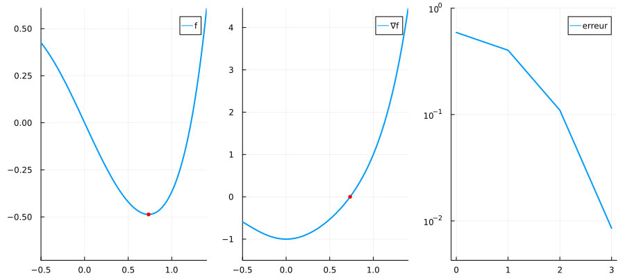

# Projet d'optimisation numérique

## Récupérer les sources

Pour récupérer les sources, il faut cloner ce dépot git. Vous pouvez suivre les instructions :
[Cloner un dépôt Gitlab](https://gitlab.irit.fr/toc/etu-n7/documentation/-/wikis/Cloner-un-projet-Gitlab).

## Organisation des sources

Les sujets liés au projet se trouvent dans les notebooks du répertoire `notebooks`. Voici l'ordre des sujets :

* Newton
* Régions de confiance
* Lagrangien augmenté

Pour réaliser le projet vous aurez besoin de cette [documentation](https://gitlab.irit.fr/toc/etu-n7/projet-optinum/-/raw/master/doc-projet.pdf) qui décrit les différents algorithmes à implémenter.

## Installation de Julia

Si vous n'avez pas encore installer Julia sur votre compte N7 ou sur votre machine personnelle, suivez les instructions :
[Utilisation de Julia à l'N7](https://gitlab.irit.fr/toc/etu-n7/documentation/-/wikis/Utilisation-de-Julia-à-l'N7).

## Illustration de la méthode de Newton

